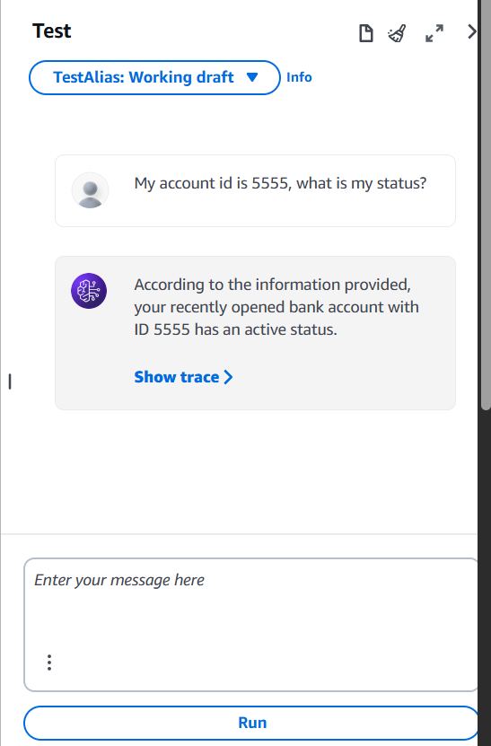

# Retail bank agent

A bedrock agent that can call lambda functions to fetch information from a dynamodb database

## Setup

Follow the steps of PREREQUISITES.md.

## Create the infrastructure

    terraform init
    terraform apply -auto-approve

## Access the bot

Go to the console and ask questions using the test window

# Troubleshooting

## elastic: Error 403 (Forbidden): User does not have permissions for the requested resource

This error means that terraform tried to create some resources and permissions out of order. It should be fixed by adding the right 'depends_on' clause.

In the meanwhile, run terraform apply a second time will succeed, as the permissions will have been created.

